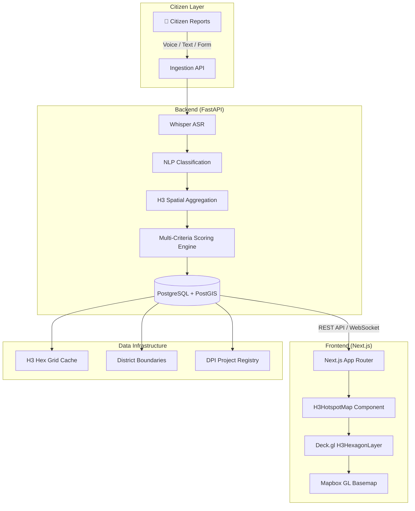

# CivicPulse AI — System Architecture

> Last updated: 2026-09-03 (Agent Iteration #1)

## Overview

CivicPulse AI is a civic-tech platform that aggregates citizen infrastructure complaints, scores them using multi-criteria analysis, and visualizes priority hotspots on an interactive 3D hexagonal map. The system helps policymakers and urban planners identify underserved zones and allocate resources effectively.

---

## System Topology



---

## Data Flow

```
1. INGEST    → Citizen submits complaint (text, voice, or form)
2. PROCESS   → Backend classifies complaint category via NLP
3. GEOCODE   → Complaint location mapped to H3 resolution-8 cell
4. AGGREGATE → Cell-level metrics computed (demand, vulnerability, deficit)
5. SCORE     → Composite priority = 0.4×demand + 0.3×vulnerability + 0.3×deficit
6. SERVE     → REST endpoint returns H3HexData[] for the viewport
7. RENDER    → Deck.gl H3HexagonLayer renders colored/extruded hexagons
```

---

## Component Hierarchy

```
app/
├── layout.tsx                    # Root layout (Inter font, dark theme)
├── globals.css                   # Tailwind + Mapbox overrides
└── page.tsx                      # Dashboard page (dynamic imports H3HotspotMap)

components/
└── map/
    ├── H3HotspotMap.tsx          # Main map: DeckGL + H3HexagonLayer + Mapbox
    ├── MapControls.tsx           # Overlay: metric selector, elevation, legend
    └── MapTooltip.tsx            # Hover tooltip: scores, category, DPI

lib/
├── map-utils.ts                  # Color scale, formatting, category helpers
└── mock-h3-data.ts               # Deterministic mock data generator (Delhi NCR)

types/
└── h3.ts                         # H3HexData, H3HotspotMapProps interfaces
```

---

## Tech Stack

| Layer          | Technology                                    |
| -------------- | --------------------------------------------- |
| Frontend       | Next.js 16, React 19, TypeScript              |
| Map Engine     | Deck.gl (H3HexagonLayer) + Mapbox GL JS       |
| Styling        | Tailwind CSS v4                                |
| Icons          | lucide-react                                   |
| Hex System     | h3-js (Uber H3 spatial index)                  |
| Backend        | FastAPI + Uvicorn (Python)                     |
| Database       | PostgreSQL + PostGIS                           |
| ASR            | OpenAI Whisper (planned)                       |

---

## Deployment Notes

- **Mapbox Token**: Set `NEXT_PUBLIC_MAPBOX_TOKEN` in `client/.env.local`
- **H3 Resolution**: Resolution 8 (~0.74 km² per cell) for city-level analysis
- **SSR Exclusion**: Deck.gl/WebGL components are dynamically imported with `ssr: false`
