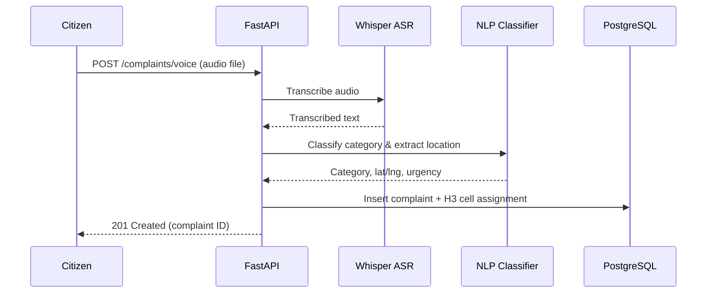

# CivicPulse AI — Backend Specification

> Last updated: 2026-09-03 (Agent Iteration #1)

## Overview

The backend is built with FastAPI (Python) and serves as the data processing and API layer. It handles citizen complaint ingestion, NLP classification, H3 spatial aggregation, and multi-criteria scoring.

---

## Current State

The server is in early development with a minimal FastAPI scaffold:

```python
# server/main.py
app = FastAPI()

@app.get("/")
def read_root():
    return {"message": "Home Route"}
```

**Running**: `uvicorn main:app --host <HOST> --port <PORT> --reload`

---

## Planned API Routes

### Complaint Ingestion

| Method | Route                    | Description                          |
| ------ | ------------------------ | ------------------------------------ |
| POST   | `/api/v1/complaints`     | Submit a new complaint (text/form)   |
| POST   | `/api/v1/complaints/voice` | Submit voice complaint (Whisper ASR) |
| GET    | `/api/v1/complaints`     | List complaints (paginated, filtered)|

### H3 Spatial Data

| Method | Route                    | Description                           |
| ------ | ------------------------ | ------------------------------------- |
| GET    | `/api/v1/h3/hexagons`    | Return H3HexData[] for map viewport   |
| GET    | `/api/v1/h3/hexagons/{h3Index}` | Detailed data for a single cell |
| GET    | `/api/v1/h3/stats`       | Aggregate statistics across all cells |

### Districts & DPI

| Method | Route                    | Description                           |
| ------ | ------------------------ | ------------------------------------- |
| GET    | `/api/v1/districts`      | List all districts with boundaries    |
| GET    | `/api/v1/dpi/projects`   | Active government capex projects      |

---

## Whisper Integration (Planned)



---

## Clustering Logic (Planned)

The scoring engine computes cell-level metrics:

1. **Demand Score** (0-1): Normalized complaint volume × urgency weighting
2. **Vulnerability Score** (0-1): Socio-economic indicators (census data overlay)
3. **Deficit Score** (0-1): Infrastructure gap based on facility density
4. **Composite Priority** (0-1): `0.4 × demand + 0.3 × vulnerability + 0.3 × deficit`

Spatial clustering uses DBSCAN over H3 cell centroids to identify contiguous hotspot regions for alert generation.

---

## Environment Variables

| Variable   | Description         | Example       |
| ---------- | ------------------- | ------------- |
| `HOST`     | Server bind address | `0.0.0.0`    |
| `PORT`     | Server bind port    | `8000`        |

---

## Dependencies

```
fastapi
uvicorn
python-dotenv
# Planned:
openai-whisper
h3
psycopg2-binary
sqlalchemy
geoalchemy2
scikit-learn
```
